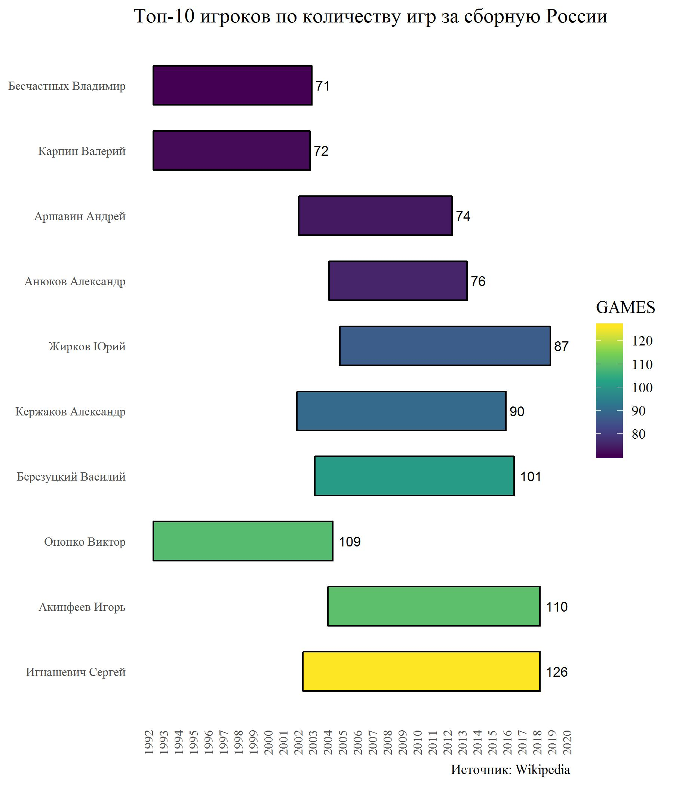
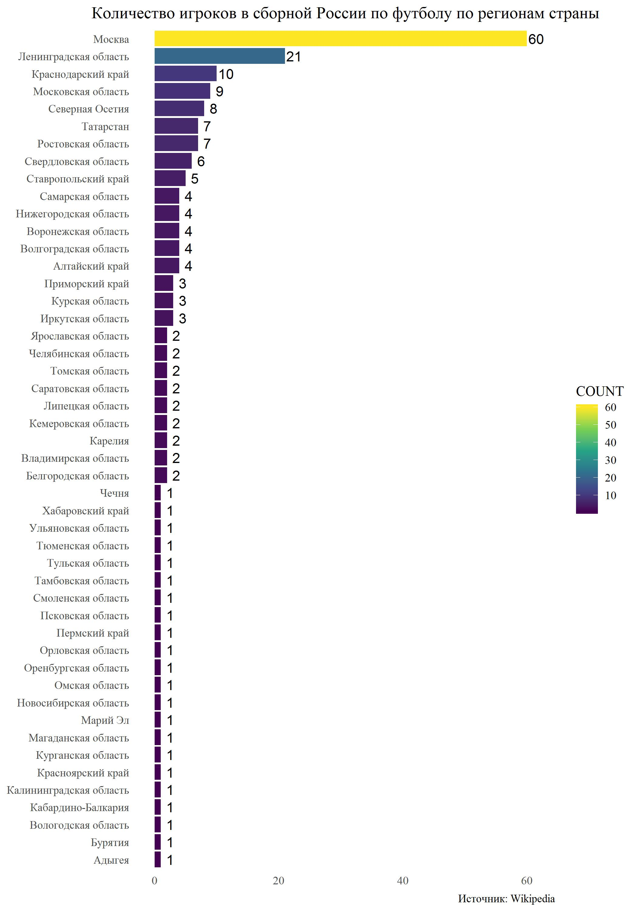
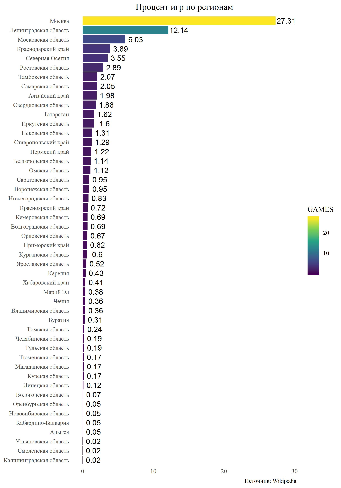
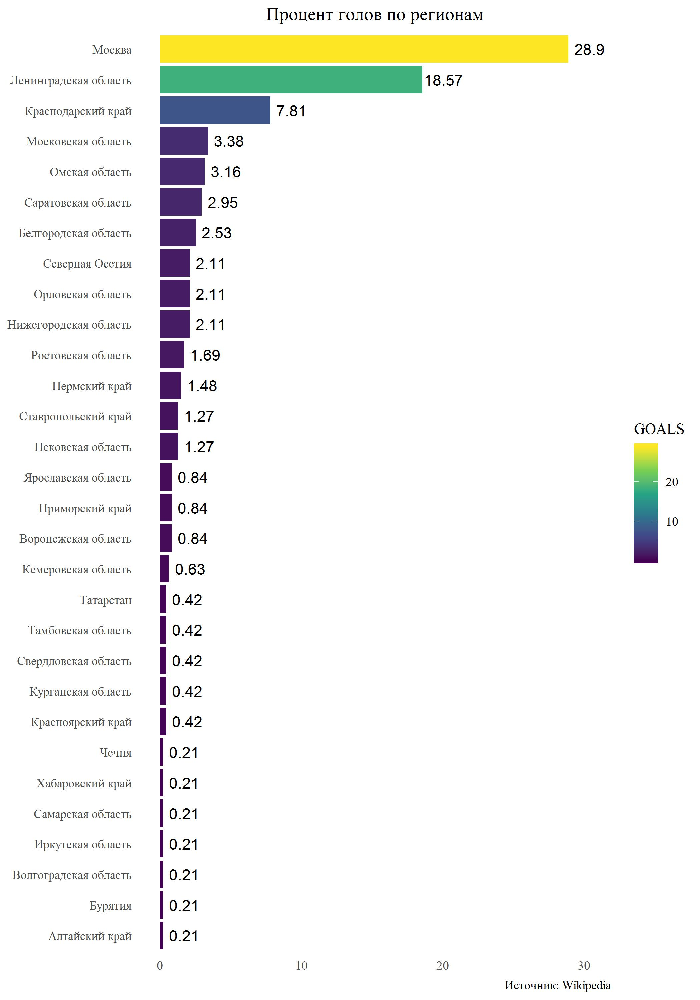
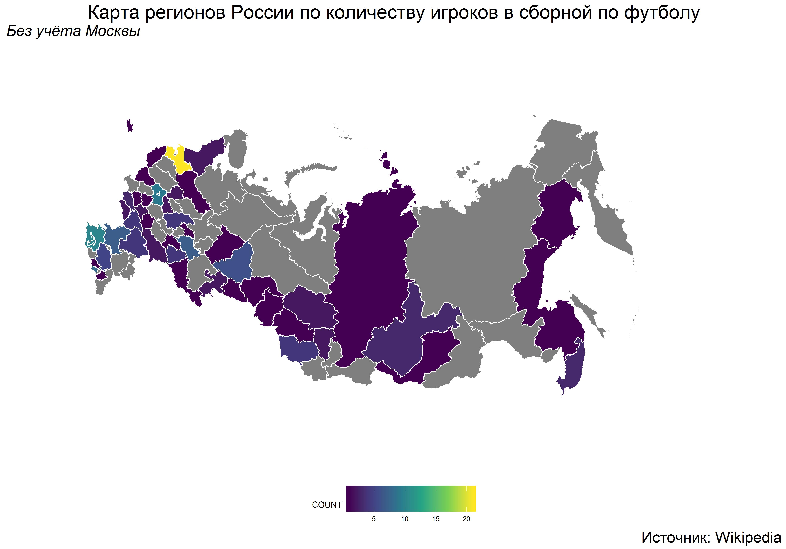
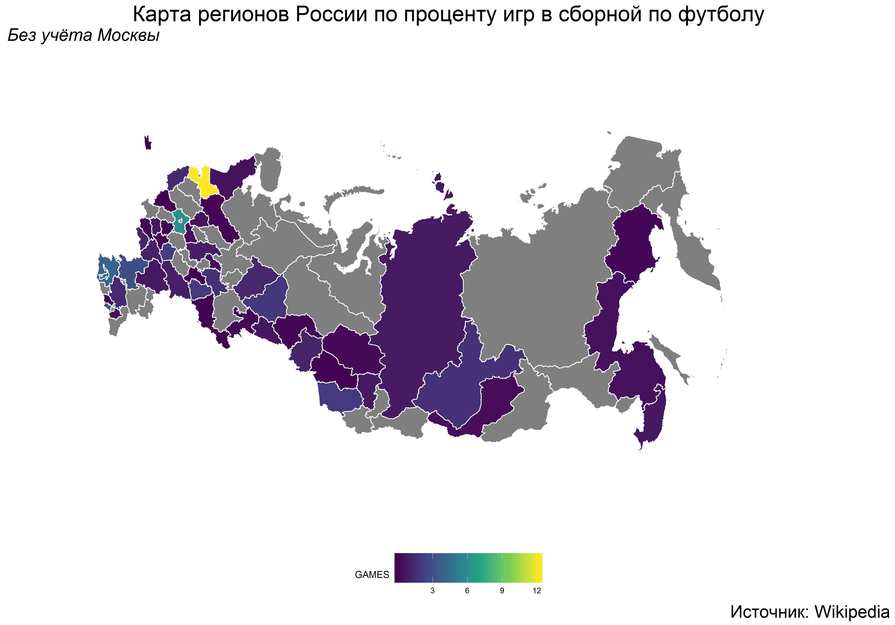
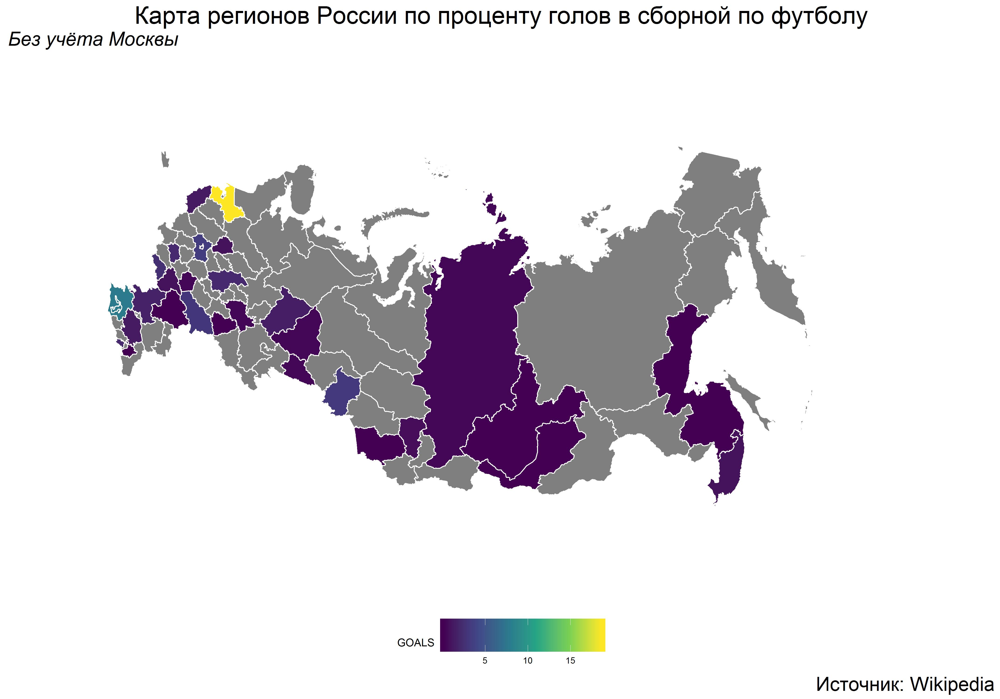

# scraping_and_plotting_maps
Web-scraping data from Wikipedia and building a map of Russia with regions in R.

# Топ-10 игроков сборной России по футболу по количеству игр.

# Количество игроков в сборной по регионам

# Процент игр за сборную по регионам

# Процент голов за сборную по регионам

# Карта России с количеством игроков сборной по регионам (кроме Москвы)

# Карта России с процентом игр за сборную по регионам

# Карта России с процентом голов за сюорную по регионам

